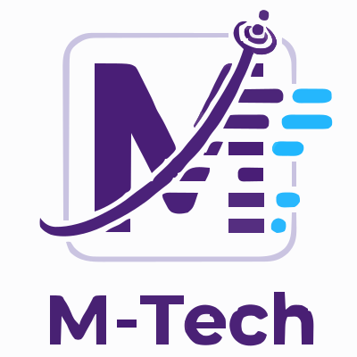

  

  <h1>🚀 M-Tech: Engineering Tomorrow. Automating Today.</h1>

  

    <em>Morph Technologies — boutique software engineering — PHP/Laravel, Java/Spring Boot, Python, and React, built to fintech-grade reliability.</em>
  

  <!-- Badges -->
  

    
  

 

## 🌟 About M-Tech

**M-Tech** (Morph Technologies) is a boutique software engineering shop specializing in web delivery (Laravel, Spring Boot, Django/FastAPI, React), backend & API engineering (PHP, Java, Python), and system modernization — from company portfolio sites and e-commerce to custom business solutions, built with fintech-grade reliability and senior-level craftsmanship, without an agency layer in between.

### 💡 Our Mission
> High-quality, reliable software delivered directly by the engineer who builds it — no handoffs, no juniors learning on your codebase.

 

## 📦 Products

### laravel-gitstamp
A Laravel package that stamps a deploy-time version (date + short git SHA) so you can display exactly what's running in production without SSH access or shelling out to git on every request.

  
  
  

CI-tested across Laravel 10–12 (PHP ^8.1), with Laravel 9 supported at runtime. MIT licensed.

**[View on GitHub →](https://github.com/m-tech-org/laravel-gitstamp)**

### google-drive-backup-utility
Open-core backup tool — schedules compressed backups of files and databases straight to your own Google Drive, no third-party cloud middleman. Free, source-available core; Pro tier adds database backup, encryption, retention, and failure alerts.

**[Free core →](https://github.com/m-tech-org/google-drive-backup-utility-core)** · **[Pro on Gumroad →](https://gumroad.com/products/google-drive-backup-utility)**

### HRMACS — HR Management & Access Control
Modular Laravel RBAC system (users, roles, permissions) built as reusable, isolated modules for larger HRMS builds.

**[View on GitHub →](https://github.com/m-tech-org/hrmacs)**

### VaultAGramBot
Telegram bot that turns a private Telegram channel into free file storage — Go, Postgres, Redis, JWT-secured admin API, worker-queue architecture, longpoll/webhook delivery modes.

**[View on GitHub →](https://github.com/m-tech-org/VaultAGramBot)**

 

## 🏗️ Delivered Work

### Aerotia International
- **Corporate Website** — [aerotia.com](https://aerotia.com), a CMS-backed dynamic website built with Laravel and React/TypeScript.
- **Website CMS** — the Laravel + Blade admin panel content editors use to manage the corporate website (home, about, capabilities, clients, blog, contact settings) without redeploying the frontend.
  Demo CMS: [dev-cms.aerotiaint.com](https://dev-cms.aerotiaint.com/) — `test@aerotiaint.com` / `Cms@123@test1234` · Demo Website: [dev-web.aerotiaint.com](https://dev-web.aerotiaint.com/)
- **Accounting Portal** — internal ledger/accounting admin tool tracking organizations, projects, and project costs. Built with Laravel 9, and integrates M-Tech's own [laravel-gitstamp](https://github.com/m-tech-org/laravel-gitstamp) for deploy version tracking.
  Demo: [mtech-accounting.freedev.app/admin/login](https://mtech-accounting.freedev.app/admin/login) — `aerotia_operator` / `operator@123`

### School Transport Management Platform
Multi-tenant SaaS platform for school transport operators — parents book and pay online, admins run role-based portals. Go microservices (gRPC + Kafka), React admin portal, live GPS trip tracking. In active development.

### Crypto Signal Trading Bot
Java bot that detects chart-pattern breakout signals on Binance and executes trades against a profit target.

 

## 🛠️ What We Do

- **Backend & API Engineering** — PHP/Laravel, Java/Spring Boot, Python (Django, FastAPI), Node.js
- **Web App Delivery** — Laravel, Spring Boot or Django/FastAPI + React/TypeScript, end to end
- **Company & Portfolio Sites** — from marketing pages to e-commerce storefronts
- **Custom Business Solutions** — fintech-grade reliability patterns applied wherever they fit
- **Legacy Modernization & Integration** — connecting and updating existing systems

 

## ⚡ Technology

### ⚙️ Backend Development

  
  
  
  
  
  
  
  
  

### 🎨 Frontend Development

  
  
  
  

### 🗄️ Databases & Storage

  
  
  

### 🚀 DevOps & Infrastructure

  
  
  
  
  

 

## 📞 Let's Build Something

### 💼 Ready to Start Your Project?
Happy to discuss how M-Tech can help bring your idea to life.

### 📧 Contact
- **Email:** [mtechltd2021@gmail.com](mailto:mtechltd2021@gmail.com)
- **Website:** [m-tech-org.github.io](https://m-tech-org.github.io)
- **GitHub:** [github.com/m-tech-org](https://github.com/m-tech-org)
- **LinkedIn:** [linkedin.com/company/mtechltdbd](https://www.linkedin.com/company/mtechltdbd/)

 

---

### 📄 License & Copyright

  <i>Copyright © 2021–2026 M-Tech. All rights reserved.</i> 
  All trademarks and logos are the property of their respective owners.

---

*"Engineering Tomorrow. Automating Today."* - **M-Tech**

